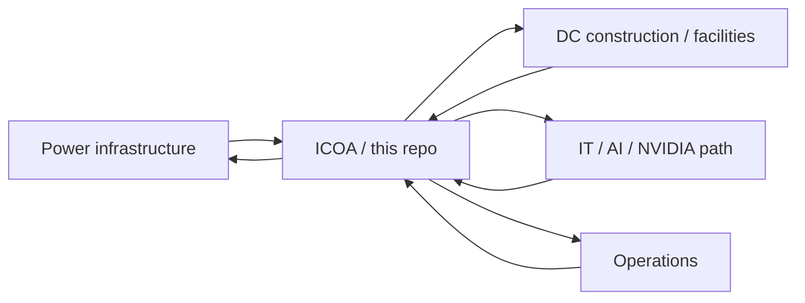

# Stakeholders and technical interfaces

The architect’s job is not to own every system. It is to be the **joint** where four delivery machines meet.

## Four teams

| Team | Owns (physical) | Must consume from ICOA | Typical failure if isolated |
| --- | --- | --- | --- |
| **Power** | Generation, 765/345 kV, substations, BESS, protection, fuel | Module electrical SLA, Gold vs Titanium, data tags, islanding modes | A plant that cannot talk to halls or the twin |
| **DC construction** | Shell, HVAC/liquid, BMS, fire, civil, EPC packages | Module geometry, liquid constitution, IST while live, vendor-replaceable interfaces | Eight beautiful halls, eight BMS dialects |
| **IT / AI** | Network, servers, GPU, fabric, scheduler, tenant overlay | Power/cooling telemetry contracts, checkpoint-on-alarm, zones | A cluster that trips the campus or is blind to OT |
| **Operations** | 24/7 desks, work orders, EHS, vendors, knowledge | Autonomy model, access policy, runbooks, AI bounded actions | Heroics instead of a copyable operating system |

**This office** owns the ICOA, the standards, the design-review checklist, the telemetry/twin/AI *architecture* (not necessarily the production model training), and the vendor-evaluation *criteria*. It does not replace the PE of record, the DOE site office, AEP, or NVIDIA.

## RACI (first 90 days)

| Artifact | Power | DC | IT/AI | Ops | ICOA office |
| --- | --- | --- | --- | --- | --- |
| Vision / goals | C | C | C | C | **A/R** |
| Compute Module definition | C | **R** | C | C | **A** |
| Campus Core (HV, water, identity) | **R** | C | C | C | **A** |
| IT/OT zones and SoR | C | C | **R** | C | **A** |
| Autonomy / access | C | C | C | **R** | **A** |
| PUE/WUE/SLA standards | C | **R** | I | C | **A** |
| Agentic AI use cases | I | I | C | **R** | **A** |
| Vendor/EPC technical scoring | C | **R** | C | C | **A** (criteria) |
| 30/60/90 plan | C | C | C | C | **A/R** |

A = accountable, R = responsible, C = consulted, I = informed.

## Cadence

- **Twice weekly:** ICOA standup (blockers across the four teams)
- **Weekly:** Architecture forum — one ICOA question until it has an owner and a v0.x answer
- **Biweekly:** Design-review dry run on a real P1 package
- **Day 30 / 60 / 90:** Gate reviews with the four team leads (see [../04-delivery/30-60-90-plan.md](../04-delivery/30-60-90-plan.md))
