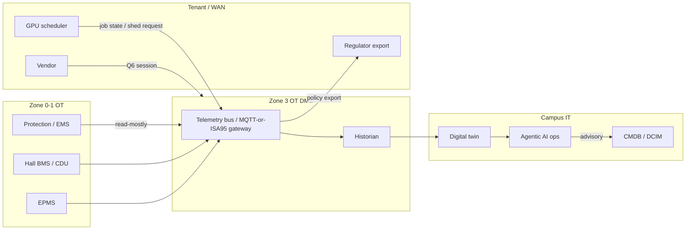

# Q04 — IT / OT data flow

**Question:** How should IT and operational technology (OT) data flow securely and reliably across systems?

## Decision (v0.1)

OT does not sit on the GPU fabric. The GPU fabric does not sit on the BMS. They meet at a **campus telemetry bus** in the Campus Core, through **brokers and data diodes / unidirectional gates** where safety-critical OT must not be writable from IT.

## Flow rules

1. **Write authority follows Q5.** A twin or agent does not write a breaker tag that EMS owns.
2. **East–west OT** (relay to relay, CDU to CDU) stays in the CM or the protection network — not via the twin.
3. **Northbound** (OT → bus → twin → AI → people) is the default.
4. **Southbound** (AI/IT → OT) is **deny by default**, allow-list per Q3 class A/S, always logged, always inhibitable.
5. **Time-sync** (PTP/GPS) is its own network, consumed by both protection and fabric.
6. **Reliability:** the bus is Gold SLA. A CM may run locally if the bus is down; it may **not** lose protection because the bus is down.

## Protocols (preference, not a brand lock)

- Electrical: IEC 61850 / DNP3 as AEP and plant require, mapped to the bus
- Buildings: BACnet/IP or vendor native **behind** a gateway that emits the standard tag dictionary
- IT/cluster: well-defined API (job shed, rack power cap) — no SNMP sprawl into OT
- Historians: one campus instance (HA), not one per CM

## Phase 1 evidence

A single diagram: CM-01 points → gateway → bus → historian → twin, with **no** GPU VLAN on the BMS switch. That drawing is a design-review gate.
