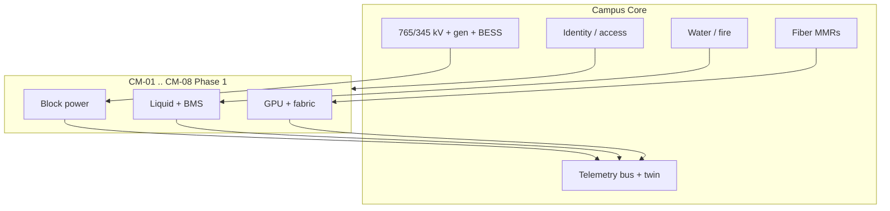

# 01 — Integrated Campus Operating Architecture

This folder **is** the ICOA. Domain blueprints (`02-blueprint/`) implement it. They do not replace it.

The first 90 days produce **v0.9 answers** to these questions. v1.0 is declared when Phase 1 design reviews use this folder as a gate (see standards).

| # | Question | File | 90-day depth |
| --- | --- | --- | --- |
| 1 | What physical, operational, and digital parts make a repeatable module? | [Q01](Q01-campus-module.md) | Frozen module boundary |
| 2 | Campus core vs distributed? | [Q02](Q02-core-vs-distributed.md) | Service catalog |
| 3 | Autonomous / supervised / manual? | [Q03](Q03-autonomy-model.md) | Control matrix |
| 4 | IT/OT data flow? | [Q04](Q04-it-ot-data-flow.md) | Zone + bus sketch |
| 5 | System of record, owner, sharing? | [Q05](Q05-data-authority.md) | SoR table |
| 6 | Remote / external access? | [Q06](Q06-access-control.md) | Policy states |
| 7 | Scenarios and failure isolation? | [Q07](Q07-scenarios-and-failures.md) | Event catalog |
| 8 | Live campus expansion? | [Q08](Q08-live-campus-expansion.md) | Energized vs outage list |
| 9 | Vendor replaceability? | [Q09](Q09-vendor-replaceability.md) | Lock vs open |
| 10 | 800 MW → 10 GW without islands? | [Q10](Q10-scale-800mw-to-10gw.md) | Scale rules + KPIs |
| 11 | Everything else we must not forget | [Q11](Q11-additional-questions.md) | Backlog, owners |

**ICOA v0.1 (now):** opinionated enough to design against. **Not** PE-stamped.

