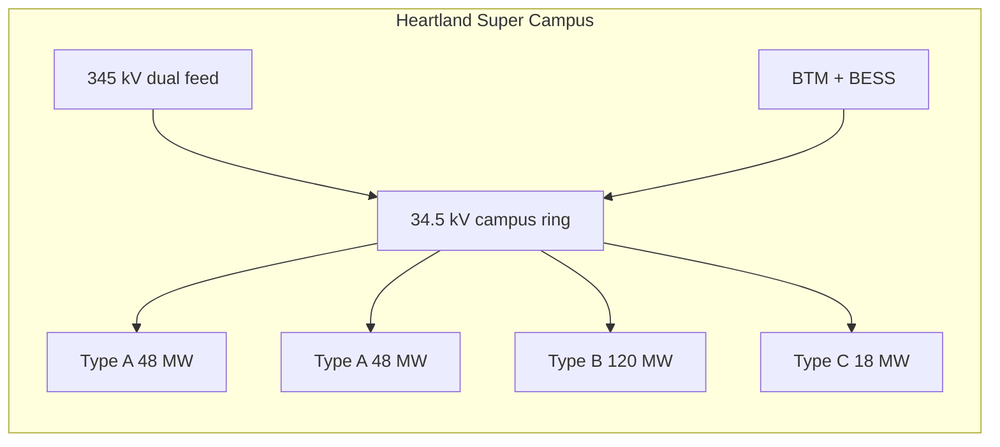

# 03 — Campus master plan

The campus is a **power and water machine** that hosts standardized compute blocks. Pads, roads, and yards are laid out so P4 does not trench through P1.

## Land program (1,100 acres)

| Use | Acres | Notes |
| --- | --- | --- |
| Building pads (12 buildings + future) | 280 | 22–28 acres per Type B pad including yards |
| 345 kV / 34.5 kV electrical | 80 | Dual yards, expansion to 765 kV |
| BTM generation + BESS + fuel | 120 | CCGT / future SMR setbacks |
| Roads, logistics, construction village | 80 | Loop road; transformer path |
| Stormwater, wetlands, habitat | 220 | Ohio EPA / isolated wetlands |
| Setbacks, berms, visual buffer | 200 | Neighbor license to operate |
| Water, fire, warehouse, admin, NOC | 40 | Dual fire tanks, warehouse for 20-year spares |
| Unallocated / densification reserve | 80 | Do not sell this |

If the winning parcel is a tighter brownfield (~400–600 acres), **drop unallocated and shrink buffers**, but do not drop the second 345 kV approach or the BTM pad.

## Building types (frozen)

### Type A — Cloud / general compute — 48 MW IT

Two halls, single story, 12 kW average rack, 4,000 racks. Air-side economizer plus rear-door or in-row for hot aisles. **Liquid headers installed**, CDUs optional in P1, mandatory on refresh. 2N UPS, N+1 mechanical. This is the control-plane and classic VM/storage neighbor, not the training factory.

### Type B — AI factory — 120 MW IT

Two-story, high-density, 100 kW average rack (design envelope 80–150 kW, structure and pipe for 200 kW). 1,200 racks. Closed-loop DLC, CDU galleries, roof and yard dry coolers. Block-redundant MV, BESS ride-through, checkpoint-friendly SLA. Short copper/optical between GPU domains — the two-story section exists to cut scale-out diameter, not for architectural novelty.

### Type C — Core — 18 MW IT

Storage, campus network core, identity, out-of-band, DNS, secrets. 2N electrical and mechanical. Highest physical security. Lives on Gold power. Never share a fire zone with a Type B hall.



## Illustrative site diagram

North is electrical (utility). South is generation (BTM), so a fault or fire in one does not take the other. East–west is the building spine. Fiber MMRs sit on the east and west corners.

```text
        345 kV corridor A                    345 kV corridor B
                \                                  /
                 \----- 345 kV yard N  -----------/
                           |  34.5 kV ring
     West MMR ----[ A ][ A ][ B ][ B ][ B ][ C ][ B ][ B ]---- East MMR
                           |                    |
                      loop road            warehouse/NOC
                           |
                 [ BTM CCGT / SMR pad ]   [ BESS ]
                           |
                    habitat / berm / public road
```

Exact stacking is a civil exercise after G0. The **rule** is: do not put P4’s next Type B on the only remaining pad that cuts the 34.5 kV ring or the process-water main.

## Phasing on the ground

| Phase | Energize | Civil that must already exist |
| --- | --- | --- |
| P0 | Nothing IT | Both HV approaches graded, one yard built, loop road, duct bank, fire water, security fence |
| P1 | 2A + 1B + C | First 34.5 kV loop closed, process water, two fiber laterals, admin/NOC |
| P2 | +1A + 2B | Second MV substation, first BTM block |
| P3 | +3B | 765 kV option or second BTM block; SMR early works if gated |
| P4 | +2B | Densify Type A to hybrid 20–30 kW; last pads |

P1 is a **complete mini-campus**. If the world stops in 2032, Heartland still functions: cloud, an AI factory, a core, dual fiber, and a real HV yard. That is the anti-stranded-asset test.

## Structural and spatial rules (all types)

- **Live load and slab:** design Type B for liquid manifolds, CDUs, and 150–200 kW racks now. Retrofit of slab and mains is how campuses die.
- **Clear height:** Type A 5.5 m+ to joist; Type B 6.5–7.5 m on compute floor, second story for network/optical.
- **Roof:** dry coolers + 25% spare area + snow/ice drift + maintenance aisles. Do not cover the roof with solar if it fights heat rejection. Put PV on parking, berms, and generation-yard canopies.
- **Prefabrication:** electrical rooms, CDU skids, and pipe racks as modules. Ohio winter makes stick-built mechanical a schedule risk.
- **Separation:** 60–100 ft building-to-building for fire department access and blast/debris; more at BESS and generation.

## Logistics

A dedicated **transformer alley** from the public road to the 345 kV yard that never shares the employee gate. Construction traffic reverses around the loop; operations traffic does not mix after P1 COD.

On-site warehouse holds 2N critical spares for 34.5 kV, CDUs, pumps, and a GPU-generation of cold plates — because PJM-event weeks are when vendors cannot roll trucks.

## Future-proofing without pretending we know 2046 silicon

We will not know the 2042 accelerator. We will know that it wants **more watts per square foot, more liquid, and more east–west optics**.

So the master plan freezes:

- Pad grid and MV loop topology
- Process-water pipe diameter (sized for 200 kW/rack on Type B pads)
- Duct-bank count (2× what P1 needs)
- Roof structural capacity for the next dry-cooler generation

And it **does not freeze**:

- Rack OEM, busbar voltage inside the white space, or training-fabric protocol

Those are P1/P2/P3 fit-out packages under the same roof.
