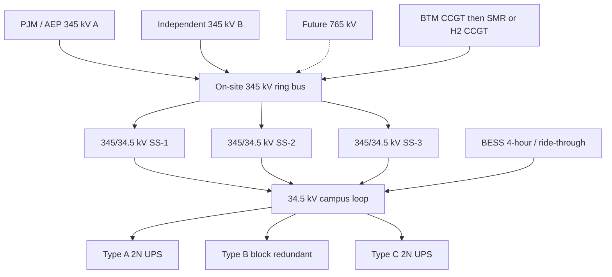

# 04 — Electrical architecture

Electricity is the campus product. Compute is the load.

## Design basis

| Item | Basis |
| --- | --- |
| Full-build IT | 1,122 MW (1,200 MW with densification) |
| Blended PUE | ~1.15 |
| Site uplift (yards, BESS HVAC, lighting, construction residual) | 5% |
| Site load | ~1,330 MW |
| Contracted interconnection | 1,600 MW, in stacked DCT blocks |
| BTM at full build | ~30% of site load (~400 MW), more if the queue slips |
| Voltage spine | 345 kV in, 34.5 kV campus, 480 V (Type A/C) and MV-to-row (Type B) |

## One-line (conceptual)

## Transmission and interconnection

- **Two independent 345 kV sources** in physically diverse ROWs. A single-tap campus is not a 20-year campus.
- On-site **345 kV ring bus** (or breaker-and-a-half) so a line or transformer outage does not island the wrong half of the site.
- Leave space and bus rating for a **765 kV** breaker position. AEP’s 765 kV spine is Ohio’s scarce asset; if a tap becomes available in P2–P3, the yard must already be shaped for it.
- Transformers: 345/34.5 kV, **N+1 per 240–360 MW block**, physically separated, with tertiary for station service.
- DCT contract capacity is **site MW**, not IT MW. Model PUE and site uplift before signing. Vanity IT numbers create 85% bills on unused transformers.

## Medium voltage campus

- **34.5 kV** as the campus distribution voltage (typical AEP large-load class; confirm at G1).
- **Looped feeders**, not radials, with automated throw-over. Open points set so a feeder fault takes one hall, not a phase.
- Each Type B building is a **~130–140 MW facility** load. That is a dedicated feeder pair, not a tap on a Type A loop.
- Underground distribution on campus. Ohio ice and vehicles do not belong on our 34.5 kV.

## Two SLAs, two downstream architectures

### Gold — Type A and Type C

Classic hyperscale: dual utility, rotary or static UPS, diesel or gas **N+1** to 48 hours of on-site fuel (or dual-fuel with firm gas), 2N to the PDU. This is what keeps IAM, storage, and the region alive when a training job is checkpointed.

### Titanium-Compute — Type B

Training clusters can checkpoint. They cannot survive a messy 20-minute ride-through design that was copied from a 5 kW cloud hall.

- MV to the hall, high-efficiency conversion at the row
- **BESS** sized for **5 minutes** of the hall plus a coordinated load-shed of training power
- Block redundancy (catcher / distributed redundant) rather than 2N UPS on 120 MW — the UPS rooms would be a campus of their own
- Generators or BTM cover **utility loss**, not every PDU
- Job scheduler is part of the electrical design: it must drain or checkpoint on under-frequency and on BESS state-of-charge

If a tenant demands 2N UPS on a 120 MW AI hall, that is a **commercial exception** with its own pad, not a silent change to Type B.

## Behind-the-meter and storage

PJM capacity prices and AEP queue depth make BTM a **schedule instrument**, not a sustainability poster.

| Era | Asset | Role |
| --- | --- | --- |
| P1 | 100–200 MW BESS | Ride-through, peak shave, DCT bill management, black start assist |
| P2 | 150–300 MW CCGT or aeroderivative, H2-ready | Firm when interconnection lags; winter capacity |
| P3 | Second thermal block **or** SMR early works | 20-year energy, less merchant gas basis |
| P4 | Long-duration storage + SMR/H2 as available | 24/7 CFE on Gold; firm AI |

BTM interconnects on the **345 kV ring**, not behind a single 34.5 kV feeder. Islanding the campus on BTM during a PJM event is an engineered mode with protection studies, not a hope.

Gas: firm transportation if we build CCGT. Ohio is in a real gas market; interruptible fuel is not an AI-factory strategy.

## Harmonics, power quality, and GPU loads

Type B load is a large, fast, coordinated converter farm. Specify:

- Harmonic studies at every phase
- Ramp-rate limits agreed with AEP/PJM
- On-site STATCOM / additional BESS MW if voltage flicker or PF becomes the interconnection constraint
- No assumption that GPU power supplies look like 2018 cloud PSUs

## Protection, grounding, arc flash

- Campus-wide IEC 61850 / modern relaying, GPS time, dual control networks
- High-resistance grounding on 480 V; low-impedance on 34.5 kV as studies dictate
- Arc-flash labels and remote racking as a construction standard, not an ops afterthought
- Separate protection for BESS (UL 9540 / NFPA 855) and liquid-cooled halls

## Energy operations

A 1.3 GW site is a **small utility**. Staff it that way: 24/7 power desk, clear switching authority, written islanding procedure, and a commercial desk that understands DCT minimum demand, PJM capacity, and offtake.

The planning model’s `heartland tariff` command exists because **ops will be billed on 85% of whatever we reserved**. Electrical architecture and commercial architecture are the same drawing.
