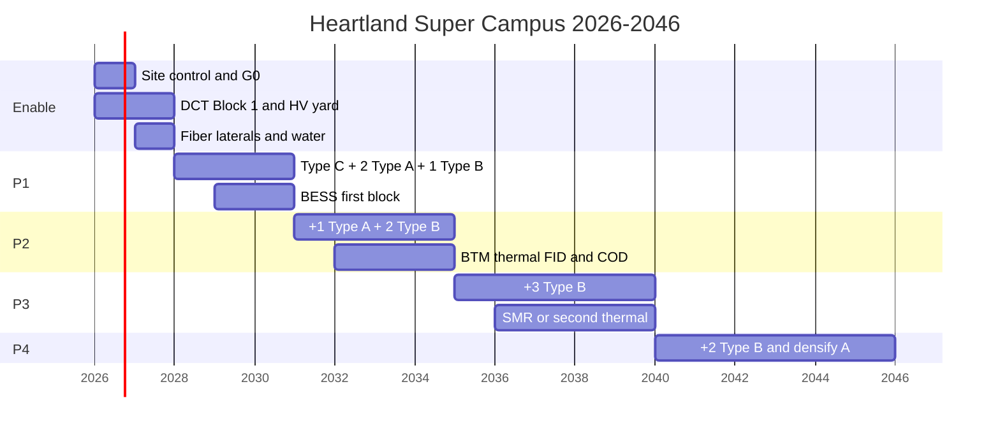

# 10 — Twenty-year roadmap, commercial, and risks

## Schedule logic

The critical path is **interconnection + tariff collateral + HV yard**, then fiber laterals, then the first Type B (longest lead: transformers, CDUs, switchgear). Buildings are on the second path.

## Capital (shell, 2026 USD)

From `data/assumptions.yaml` via the living model — **order of magnitude, not a bid**:

- Type A $11.5 M / MW IT, Type B $16 M / MW IT, Type C $14 M / MW IT
- Campus common $1.8 M / MW IT + $250 M enablement
- Land ~$45 k / acre

At 1,122 MW IT the model lands near **$19 B** shell + campus + land. Add BTM and owner’s IT separately. Escalate: Ohio labor and electrical gear are in a hyperscale boom — apply **real escalation** in the investment case, not 2% CPI.

## Commercial

- **DCT:** stack contract capacity in 250–500 MW blocks; never reserve the 2046 number in 2027. Run `heartland tariff --it-mw …` before every utility signature.
- **Collateral:** 50% of minimum charges over the 12-year shape unless the sponsor’s credit kills that requirement. This can rival a substation in cash locked.
- **Tax:** base case 50% exemption or none; upside 75% brownfield + own power.
- **Offtake:** hyperscaler or neocloud take-or-pay aligned with DCT ramp, or the owner eats 85% electrical for empty halls.
- **PJM:** capacity and congestion are opex line items with political visibility. Hedge. Do not assume 2024 prices.

## Risk register (top)

| ID | Risk | Why it kills 20-year scale | Mitigation in this architecture |
| --- | --- | --- | --- |
| R1 | Interconnection slip | No MW, no campus | Dual 345 kV, stacked DCT, BTM pad in P0, 765 kV option |
| R2 | DCT 85% on unused MW | Burns cash | Honest contract capacity, offtake alignment, BESS/tariff ops |
| R3 | Collateral / credit | Cannot sign DCT | Sponsor structure, staged blocks |
| R4 | Tax exemption gone | IRR shock | Do not underwrite 100%; brownfield+BTM hedge |
| R5 | Water politics / moratorium | Entitlements die | Closed-loop, off-Scioto, public metering |
| R6 | New Albany-style neighbor fatigue | Lawfare | Site class, buffers, compact, apprenticeships |
| R7 | Transformer / CDU lead times | P1 COD slips | Order on FID, warehouse, prefab |
| R8 | Air-cooled halls stranded by 100 kW racks | Rebuild at year 8 | Liquid-ready Type A, Type B default |
| R9 | Single fiber lateral | Region outage | Two providers, two MMRs, P0 laterals |
| R10 | BTM fuel / SMR delay | Queue still late | Land and interconnection for generation anyway; aeroderivative as bridge |
| R11 | Cyber on BMS/EPMS | Physical process outage | Isolated domains, Type C trust |
| R12 | Ice / tornado | Hall envelope, coolers | Ohio-specific civil, not a copied desert spec |
| R13 | Workforce | Quality and schedule | Village, busing, apprenticeships starting P0 |
| R14 | PJM capacity spiral | Opex and politics | PPAs, BTM, honest public CFE story |

## What the architect must not allow to drift

- Evaporative cooling “just for P1”
- A single 345 kV tap
- DCT reservation of the full 1.6 GW in year one
- Type B geometry that cannot take 200 kW racks and liquid mains
- NDAs that hide water and tax
- A site in a moratorium township because the land was cheap

Those six drifts are how a “super scale” announcement becomes a 40 MW stranded box. Heartland is the other path: **slow on vanity megawatts, fast on yards, fiber, liquid, and community, then expand for twenty years.**
